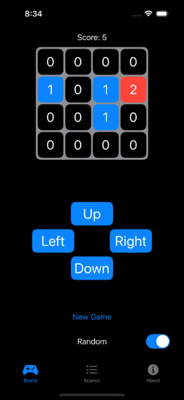
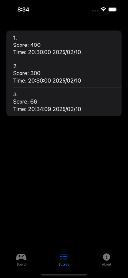

# Threes

[Gameplay Video](./demo/videoA.mp4)

## What is Threes?
Threes is a puzzle game where you slide numbered tiles on a grid to combine **1** and **2** into **3**, then merge multiples of **3** (e.g., 3+3=6, 6+6=12) to score points. The goal is to achieve the highest possible score before the grid fills up and no moves remain.

This project was developed as part of a class assignment to explore iOS app development. Due to academic guidelines, the source code for this project cannot be shared publicly.

## Why Was It Made?
This app was created as a project for my mobile development course to practice and demonstrate skills in iOS app development.

## Key Features
- **Scoreboard:** Track your high scores and review past game results.
- **Spawn Modes:**
  - **Random Spawn Mode:** Tiles spawn randomly, adding an element of unpredictability.
  - **Deterministic Spawn Mode:** Tiles spawn in a predictable pattern, allowing for testing.

## Key Takeaways
- **App Development:** Gained hands-on experience in iOS app development using **Swift**.
- **Game Design:** Learned to implement game logic and user interface design for a puzzle game.
- **Problem Solving:** Improved problem-solving skills by debugging and optimizing game mechanics.

---

### How to Play
1. Swipe tiles **up, down, left, or right** to move them.
2. Combine **1** and **2** tiles to create a **3**.
3. Merge multiples of **3** to create larger numbers and score points.
4. The game ends when the grid is full and no valid moves remain.